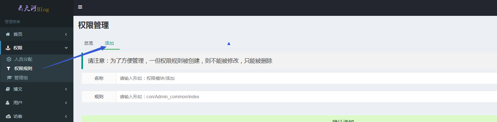
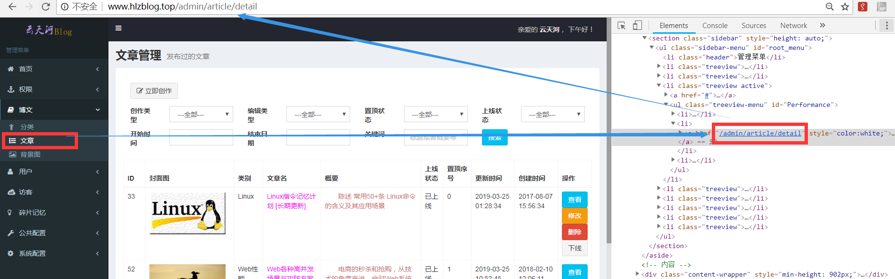
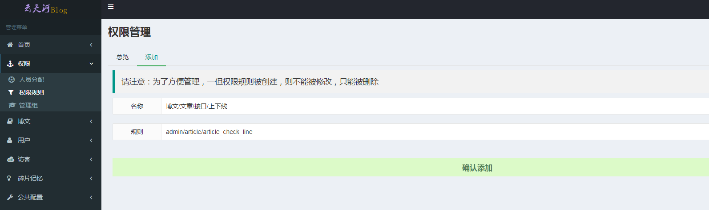
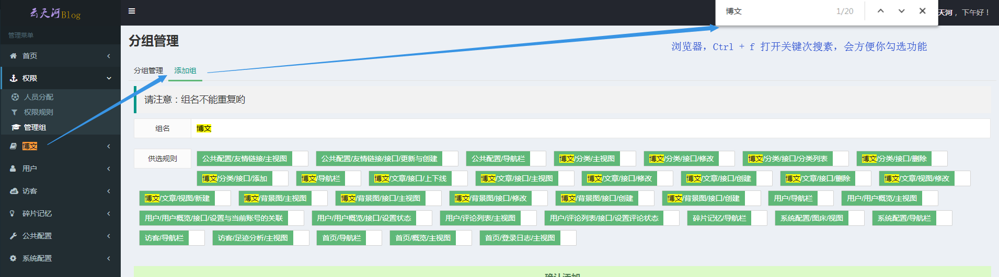
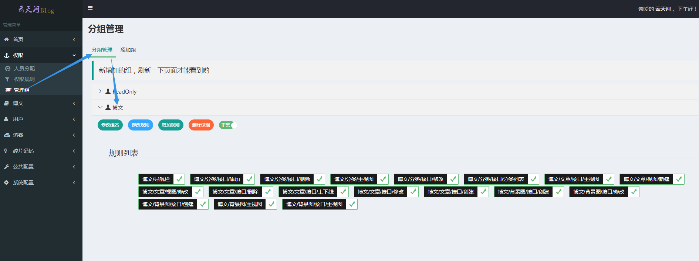
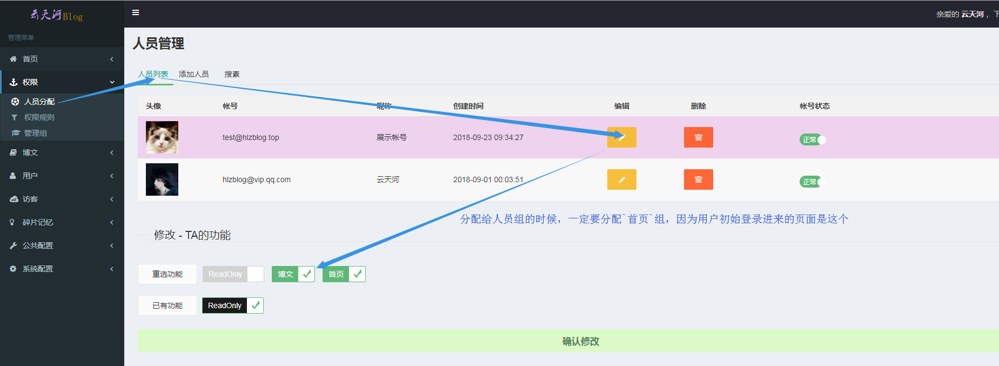
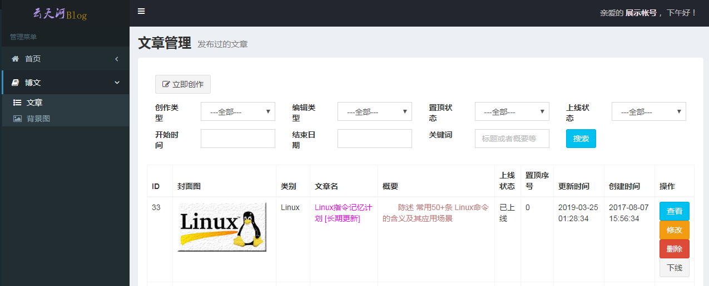

> 本次后台使用 Auth 实现权限控制  

## 设计简述

### 表设计

    `yth_avatar`.`admins` # 管理员表，超级管理员请在 config/hlz_auth.php 中设置  
    `yth_avatar`.`hlz_auth_group` # 管理员分组表：每条数据代表一个每个组拥有的所有权限  
    `yth_avatar`.`hlz_auth_group_access` # 管理员对应组：每个管理员，可以对应多个管理员分组  
    `yth_avatar`.`hlz_auth_rule` # 管理员可访问的权限规则  

### 权限检测原理

    # 某一个普通管理员
    `admins`.`id`
    # 查询他拥有的所有管理组
    -> `xb_auth_group_access`.`uid`
    # 查询每管理组下有哪些规则
    -> `xb_auth_group`.id <--> `xb_auth_group_access`.`group_id`
    # 合并所有组内的规则id
    -> `xb_auth_group`.`id` <--> `xb_auth_group_access`.`group_id`
    # 查询这些确切规则，然后整理成一个数组变量 $rule
    -> `xb_auth_group`.`rules` <--> `xb_auth_rule`.`id` # 每个规则具体内容
    服务端通过查询当前规则，是否在 $rule 数组中

## 使用简述

> 后续以 localhost 表示你所使用的域名

### 基本信息

后台登录地址

    http://localhost/admin/login

测试环境：超级管理管理员帐号相关

    帐号 test@hlzblog.top
    密码 123123

然后进入权限管理页面

    http://localhost/admin/auth_rule

  
图 1001  

功能开发完成后，找到所需路由，当前以 配置 运营模块-Banner管理模块 为例

    http://localhost/admin/login

### 权限规则-命名方式

规则名，即 request()->path() 获取的内容，示例  

    http://localhost/admin/banner/render

规则名为：

    admin/banner/render

- 主导航栏
    - 规则_模板：sidebar/<模块名英文>
    - 名称_模板：导航栏-<模块名>
        - 示例1
            - 规则：sidebar/article
            - 名称：博文/导航栏
    - 注：有主导航栏，才能看到 导航栏子级
- 导航栏子级
    - 名称_模板：模块名/<功能名>/<接口|视图|按钮>/细化的功能名称
    - 规则_模板：点击后访问的 相对于根域名的路由
        - 示例2
            - 名称：博文/文章/主视图
            - 规则：admin/article/detail
        - 示例3
            - 名称：博文/文章/接口/删除
            - 规则：admin/article/detail_del

#### 小案例

> Setp 1 配置权限规则

  
图 1002  

依据导航栏点进去的第一个页面路由，归类为 `视图`  
所以它的名称可以是 `博文/文章/主视图`

> Setp 2 设置侧边栏菜单

进入文件 `app/Repositories/Admin/Logic/MenuAdminLogic.php`

    $menu_html .= self::module('sidebar/article', '博文', 'book') // 主导航栏： 导航栏规则 + 其所导航的模块名
        ->sidebar('admin/article/category', '分类', 'child') // 导航栏子级： 相对于根域名的路由
        ->sidebar('admin/article/detail', '文章', 'list-ul')
        ->sidebar('admin/article/background', '背景图', 'picture-o')
        ->output(); // 输出导航栏的HTML

> Setp 3 设置一个侧边栏菜单里，所有的涉及的功能

如，`图1002` 里面，有 下线 功能  
会请求接口 `/admin/article/article_check_line  
所以需要添加 对应权限规则  

  
图 1003  

其他的功能同理

> Setp 4 将新增加的功能添加到权限组里面

  
图 1004  

如果没有权限组，则请按照如 图 1004 流程操作  

分配结果如 图 1005 所示

  
图 1005  

> Setp 5 将组权限分配给人员

分配过程如 图 1006 所示

  
图 1006  

> Setp 6 测试分配结果

结果 图 1007 所示

  
图 1007  

## 后记
如果没有权限  
会自动跳转到登录页面  

## 上线前准备

使用测试帐号，操作自己当次所开发的后台功能  
如果跳转到首页，说明对应权限规则没有配置  
需要自行使用前文 测试环境-超级管理管理员帐号，自行权限相关配置并测试  
每次通过后自测后，记录新增的权限名与规则名  
上线前整理好这些规则，然后告知超级管理，去进行相关配置  